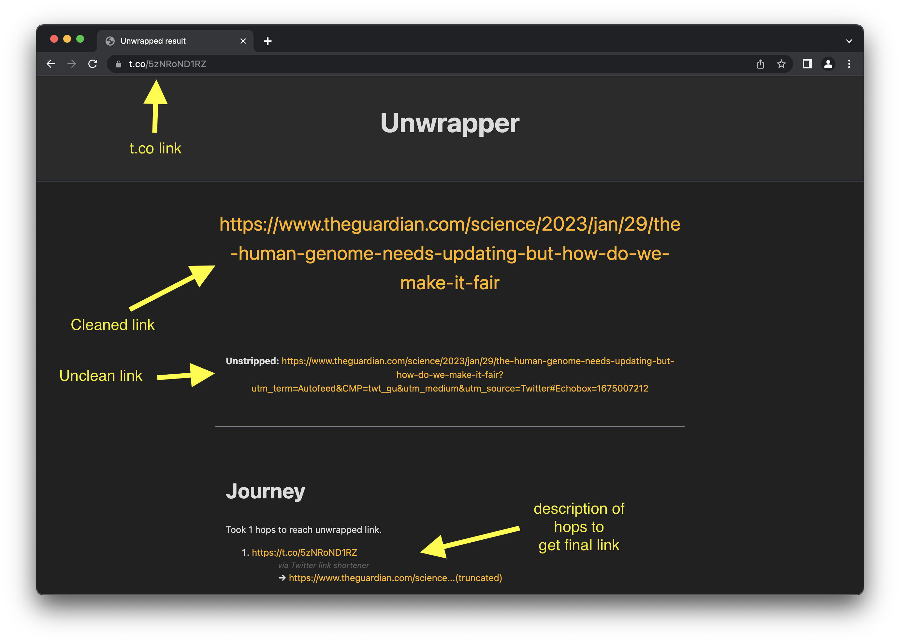

# The Unwrapper

Note, I wrote this in haste over a weekend so the code is not high quality and untested.

See this blog post for more information: https://djharper.dev/post/2023/01/29/intercepting-t.co-links-using-dns-rewrites/

## What

A system that can walk short link services like t.co to get the underlying link.

Can be used in conjunction with a reverse proxy that sets the `X-Forwarded-Host` header, and presents the user with a page with the cleaned link.

## Supports

Mainly wrote this for t.co but also supports others, see config file here: https://github.com/djhworld/theunwrapper/blob/main/config/unwrappers.json

## This is dumb and stupid

Can't argue with that. 

